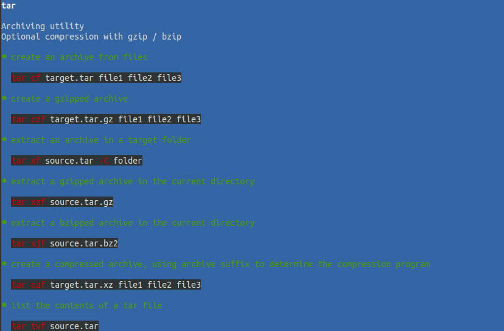

# tldr-clj

## Installation

Download from <https://github.com/iovxw/tldr-clj/releases/tag/v1.0.0>.

## Usage

    $ alias tldr="java -jar /path/to/tldr.jar"
    $ tldr -h
    Usage: tldr [options] command

    Options:
      -u, --update  Update cache
      -h, --help

## License

The MIT License (MIT)

Copyright (c) 2015 iovxw
